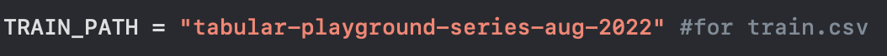
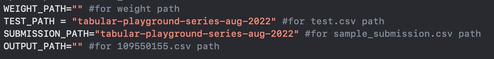
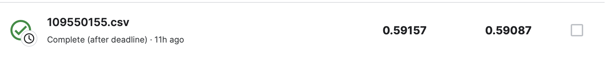

# ML_Final_project
這是一個關於[kaggle競賽](https://www.kaggle.com/competitions/tabular-playground-series-aug-2022/overview)的作品呈現，透過以下流程能成功復現。


## Menu


## installation
首先下載`109550155_Final_train.py`、`109550155_Final_test.py`、`requirements.txt`，接著用以下指令以符合執行環境。
```bash
pip install -r requirements.txt
```
接著到該kaggle競賽去下載dataset以及`sample_submission.csv`
如果想跳過training直接inference，請點選[這個drive連結](https://drive.google.com/file/d/1FUFSbKHZQIXlp2tw1QM7PHrgXpA8EU5o/view?usp=sharing)下載模型的權重
## training
進入`109550155_Final_train.py`修改以下路徑至指定位置

並執行
```bash
python 109550155_Final_train.py 
```
可以得到`logistic_regression.sav`

## inference
進入`109550155_Final_inference.py`修改以下路徑至指定位置

並執行
```bash
python 109550155_Final_inference.py 
```
可以得到`109550155.csv`，即可在kaggle競賽上繳交並獲得以下結果：


